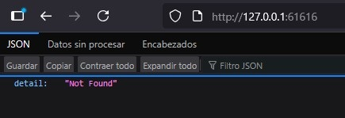
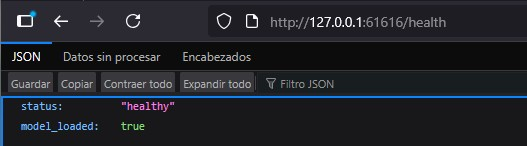
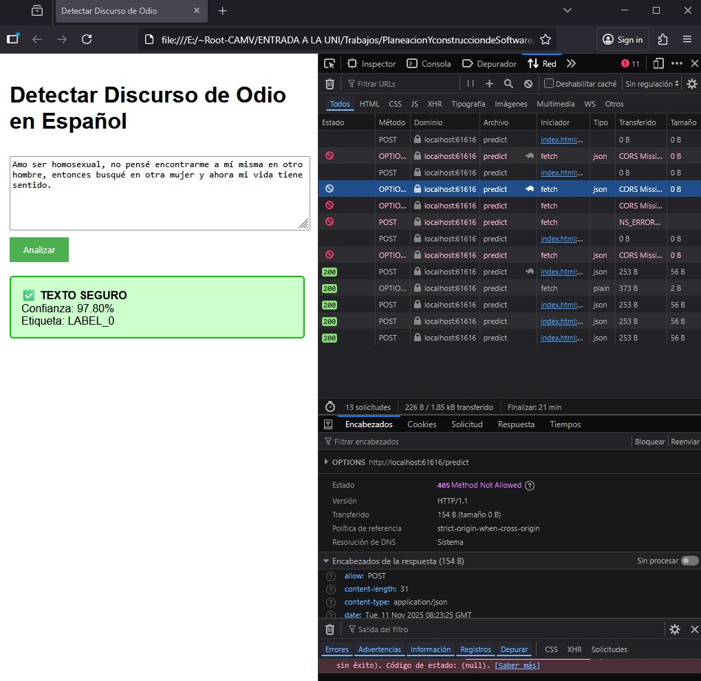
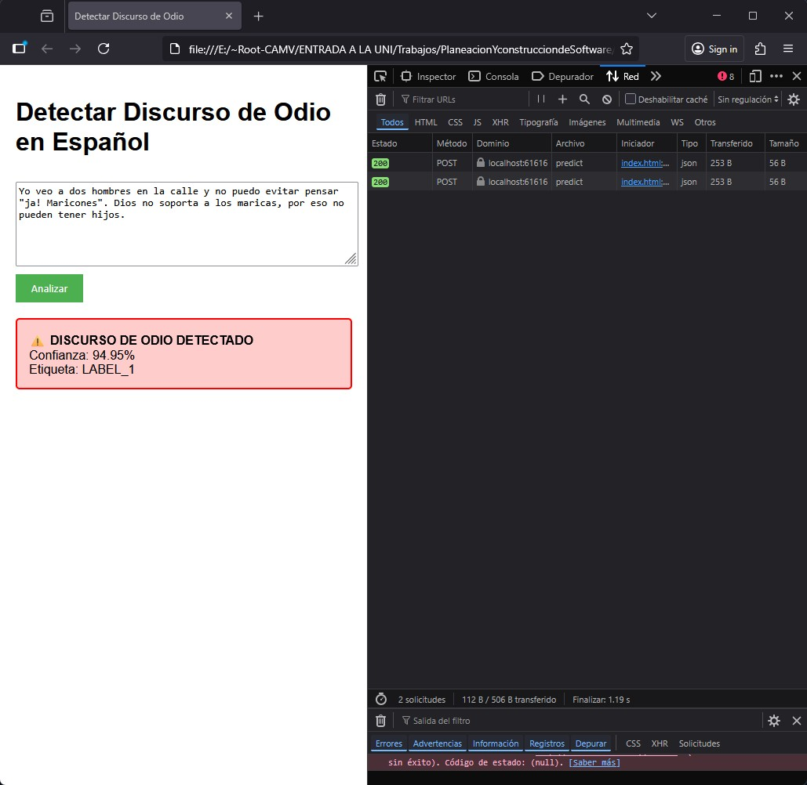

# Detector de Discursos de Odio usando BERT

## 📋 Descripción

Este proyecto implementa un sistema de detección de discursos de odio en textos en español utilizando el modelo BERT (Bidirectional Encoder Representations from Transformers). El sistema está diseñado para analizar mensajes de redes sociales y identificar contenido que promueva violencia verbal entre usuarios.

## 🚀 Características

- **Modelo BERT especializado**: Utiliza `dccuchile/bert-base-spanish-wwm-uncased` entrenado específicamente para español
- **API RESTful**: Interfaz web para realizar predicciones
- **Frontend integrado**: Interfaz de usuario amigable
- **Detección en tiempo real**: Análisis instantáneo de textos

## 🏗️ Pipeline
[Modelo Base] → [Fine-tuning] → [Exportación] → [API Web] → [Frontend]


## 📁 Estructura Final del Proyecto
```plaintext
BERT-HateSpeech/
|   .gitignore
|   optimize_model.py
|   Toxicity-Detection.ipynb
|   tree.txt
|   
+---.ipynb_checkpoints
|       Toxicity-Detection-checkpoint.ipynb
|       
+---DetectorDeOdio-finetuned
|       config.json
|       model.safetensors
|       ModelTrained.png
|       special_tokens_map.json
|       tokenizer_config.json
|       vocab.txt
|       
+---HateSpeechDetector
|   +---api
|   |   |   main.py
|   |   |   model_loader.py
|   |   |   requirements.txt
|   |   |   
|   |   +---app
|   |   |       routes.py
|   |   |       schemas.py
|   |   |       
|   |   \---__pycache__
|   |           main.cpython-311.pyc
|   |           model_loader.cpython-311.pyc
|   |           
|   \---front
|           index.html
|           
+---optimized_model
|       config.json
|       model.safetensors
|       special_tokens_map.json
|       tokenizer.json
|       tokenizer_config.json
|       vocab.txt
|       
|       
+---results
|   +---checkpoint-1680
|   |       config.json
|   |       model.safetensors
|   |       optimizer.pt
|   |       rng_state.pth
|   |       scheduler.pt
|   |       trainer_state.json
|   |       training_args.bin
|   |       
|   +---checkpoint-3360
|   |       config.json
|   |       model.safetensors
|   |       optimizer.pt
|   |       rng_state.pth
|   |       scheduler.pt
|   |       trainer_state.json
|   |       training_args.bin
|   |       
|   \---checkpoint-5040
|           config.json
|           model.safetensors
|           optimizer.pt
|           rng_state.pth
|           scheduler.pt
|           trainer_state.json
|           training_args.bin
|           
+---tests
|       API-health.jpg
|       API.jpg
|       Frontend-2.jpg
|       Frontend.jpg
|       test1.py
|       
\---venv311_HateSpeech
    |   pyvenv.cfg
    |   
    +---etc
    |   \---jupyter
    |       +---jupyter_notebook_config.d
    |       |       jupyterlab.json
    |       |       
    |       +---jupyter_server_config.d
    |       |       jupyter-lsp-jupyter-server.json
    |       |       jupyterlab.json
    |       |       jupyter_server_terminals.json
    |       |       notebook.json
    |       |       notebook_shim.json
    |       |       
    |       \---nbconfig
    |           \---notebook.d
    |                   widgetsnbextension.json
    |                   
    +---Include
    +---Lib
```


## ⚙️ Instalación y Configuración
### 1. Activación del Entorno Virtual
[En PowerShell]
> .\venv311_HateSpeech\Scripts\Activate.ps1

### 2. Instalar librerías necesarias
> pip install torch transformers datasets pandas numpy scikit-learn
> pip install fastapi uvicorn python-multipart
> pip install jupyter notebook
> pip install 'transformers[torch]' 'accelerate>=0.26.0' torch

### Para usar GPU NVIDIA (depende de la versión de CUDA)
#### Desinstalar la versión que usa la CPU
> pip uninstall torch torchvision torchaudio

#### Revisar la versión de CUDA
> nvidia-smi
> pip install torch torchvision torchaudio --index-url https://download.pytorch.org/whl/cu121

#### ó
> pip install torch torchvision torchaudio --index-url https://download.pytorch.org/whl/cu118


### 2. Iniciar Jupyter Lab
> jupyter lab

### 3. Ejecutar el Jupyter Lab (Paso por paso)

### 4. Instalación de Dependencias
> pip install -r requirements.txt

### 5. Ejecución de la API
> cd ./HateSpeechDetector/api/
> python main.py





### 6. Pruebas del Sistema
> python ./tests/test1.py

### 6. Frontend
Abrir index.html manualmente en el navegador.

## 🎯 Uso
Una vez ejecutada la API y el frontend, el sistema permite:
    1. Ingresar texto en español para analizar
    2. Obtener clasificación de discurso de odio
    3. Recibir resultados en tiempo real





## 🔧 Tecnologías
    • Modelo Base: BERT para español
    • Backend: Python, FastAPI
    • Frontend: HTML, JavaScript
    • Procesamiento: Transformers, PyTorch

### 📊 Modelo
El modelo utilizado es dccuchile/bert-base-spanish-wwm-uncased, específicamente entrenado para comprender y procesar texto en español con el objetivo de identificar patrones de discurso de odio.

### 💡 Contexto del Problema
En los textos escritos en redes sociales, se encuentran seguido insultos que promueven la violencia verbal entre las personas. Los usuarios reportan los mensajes, pero no se pueden manejar porque son demasiados.

El objetivo es entrenar el modelo BERT para que pueda detectar el odio en los mensajes de texto.